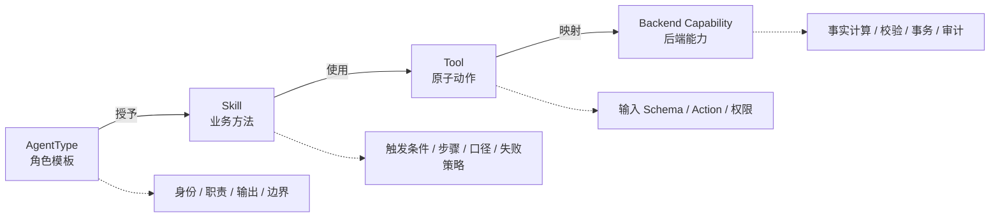
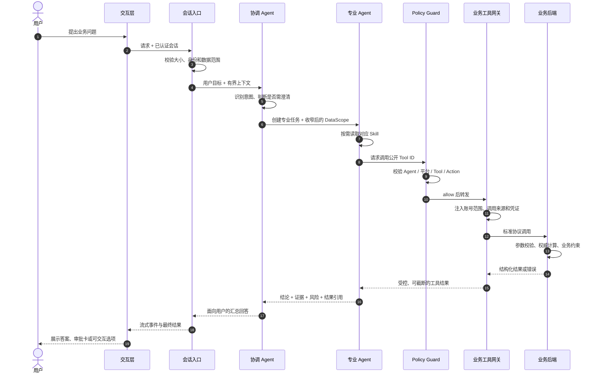
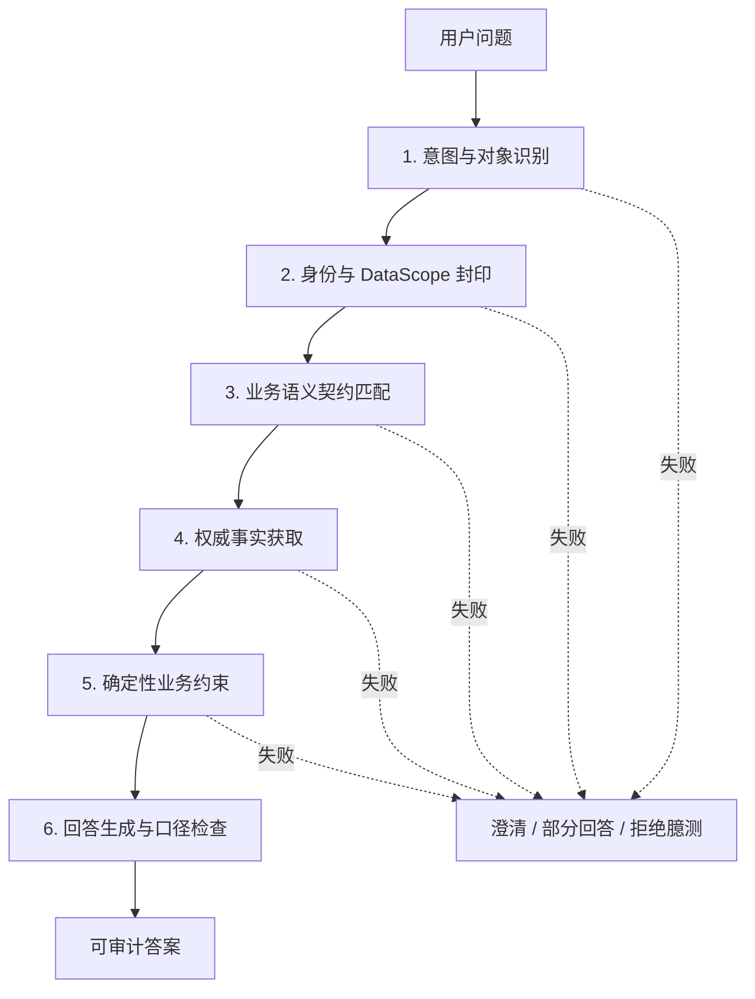
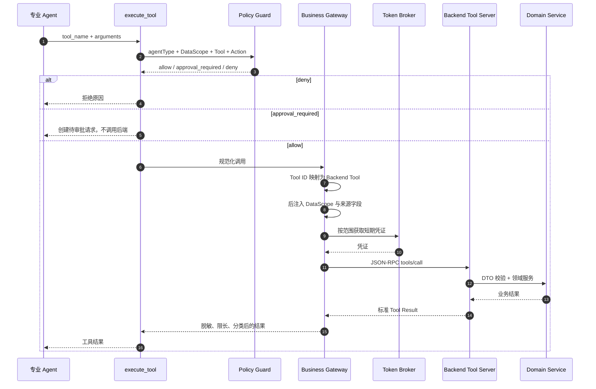
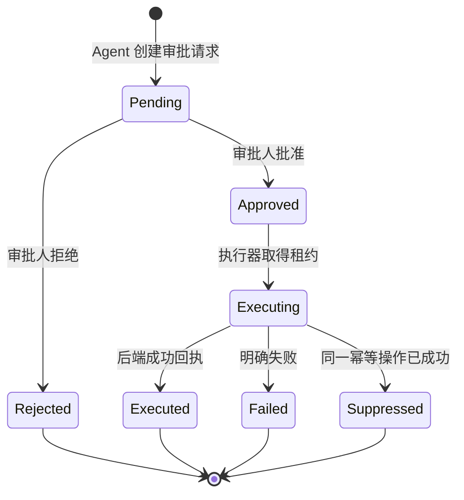

import PasswordProtect from '@site/src/components/PasswordProtect';

<PasswordProtect password="111">

# 业务型 Agent 平台可复用设计模式报告

> 文档定位：参考架构与实施手册  
> 适用对象：架构师、Agent 产品负责人、后端工程师、AI 应用工程师、测试与运维人员  
> 抽象说明：本文基于一套已实践的业务 Agent 系统提炼，所有项目名、业务平台名、角色名、接口名、仓库路径和数据名称均已泛化，不对应任何真实名称。

## 1. 报告目标

本文回答以下核心问题：

1. 一套可长期演进的业务 Agent 应如何设计，而不是只写一个大 Prompt。
2. Agent、Skill、Tool、业务后端、前端之间如何分层。
3. 如何新增一个 Agent、一个 Skill 或一个后端工具。
4. 如何保证回答基于真实业务事实、使用正确口径，并在证据不足时拒绝臆测。
5. Agent 如何安全地调用后端接口，如何注入身份与数据范围，如何处理写操作审批。
6. 如何把这一模式复制到客服、财务、供应链、销售、投研、运维等其他业务领域。

本文不把“大模型会推理”当作正确性保证。核心设计思想是：

> 让模型负责理解、规划、解释和有限决策；让确定性系统负责身份、权限、事实、约束、执行、审计和最终校验。

## 2. 一句话架构结论

推荐采用“四层运行架构 + 三层能力模型 + 多道确定性防线”：

- 四层运行架构：交互层、Agent 运行时、能力包、业务后端。
- 三层能力模型：AgentType → Skill → Tool。
- 确定性防线：认证范围、工具白名单、语义契约、后端权威校验、人工审批、审计回放。

这套模式的目标不是让模型“什么都会”，而是让每个 Agent：

- 只看到完成当前职责所需的知识和工具；
- 只访问当前用户有权访问的数据；
- 只能在业务允许的动作集合内决策；
- 对高风险写操作只能生成草稿或待审批请求；
- 所有重要结论都能回溯到数据、版本、时间与工具调用结果。

## 3. 核心设计原则

### 3.1 通用运行时不承载具体业务

Agent 运行时只负责：

- 模型会话与流式输出；
- Agent 创建、等待、通信和关闭；
- Skill 与 Tool 装载；
- 权限判断、审批、事件和审计；
- 上下文、记忆与状态管理；
- 后端网关与错误边界。

业务角色、业务流程、指标口径、工具映射和动作策略放在能力包中。新增业务域时，优先新增能力包，不修改运行时内核。

### 3.2 Prompt、Skill、Tool 各负其责

- Agent Prompt：定义“我是谁、负责什么、不负责什么、如何路由”。
- Skill：定义“遇到某类问题时，按什么业务方法完成”。
- Tool：定义“调用一次外部能力的确定性动作”。
- 后端：定义“事实如何计算、请求是否有效、动作能否执行”。

复杂业务流程不应全部堆进 Agent Prompt；接口参数和权限也不应只靠 Prompt 约束。

### 3.3 默认拒绝，而不是默认放行

以下情况默认拒绝：

- 未登记的 Agent 类型；
- 未授权的 Tool；
- Tool 与当前业务平台不匹配；
- 未声明的 Action；
- 缺少身份、租户、账号或产品范围；
- 语义契约版本不兼容；
- 高风险写动作未审批；
- 数据质量不足但模型试图给强结论。

### 3.4 事实与推理分离

系统需要显式区分：

| 类型 | 示例 | 权威来源 |
| --- | --- | --- |
| 用户意图 | “帮我分析最近一周” | 当前对话与交互确认 |
| 业务事实 | 订单、余额、状态、指标 | 业务后端或权威数据服务 |
| 业务语义 | 指标含义、单位、时间口径 | 版本化 Skill 与数据契约 |
| 推理结论 | 风险判断、原因解释、优化建议 | Agent，但必须绑定前述证据 |
| 执行结果 | 是否成功修改业务对象 | 后端执行回执与审计记录 |

Agent 不能把推理结论伪装成业务事实，也不能把“已生成建议”说成“已执行成功”。

### 3.5 能力按最小权限组合

每个专业 Agent 只获得自己需要的 Skill 和 Tool。协调 Agent 默认只持有编排工具，不直接持有全部业务工具。

这样可以同时降低：

- 工具选错概率；
- 跨业务域调用概率；
- Prompt 和工具 Schema 对上下文的占用；
- 高权限 Agent 被提示注入利用的风险；
- 单个 Agent 的认知负担。

## 4. 核心技术架构

### 4.1 系统分层图


### 4.2 组件职责

| 组件 | 主要职责 | 不应承担的职责 |
| --- | --- | --- |
| 会话入口 | 认证、限流、请求校验、SSE/流式响应 | 业务判断 |
| 协调 Agent | 理解意图、澄清、拆解、路由、汇总 | 直接拥有全部高权限工具 |
| 专业 Agent | 在单一业务边界内分析或产出建议 | 跨平台、跨账号访问 |
| Agent Control | 生命周期、并发槽、消息、超时、结果引用 | 业务知识 |
| AgentType Registry | 可创建角色的目录与组合结果 | 直接执行后端接口 |
| Skill Registry | 可复用能力与流程的版本化索引 | 持有用户会话状态 |
| Policy Guard | Tool、Action、平台、审批策略判断 | 相信模型自报权限 |
| Approval Engine | 待审批、批准、拒绝、执行、幂等 | 让模型自行批准 |
| Business Gateway | Tool 映射、范围注入、凭证注入、协议转换 | 把凭证暴露给模型 |
| 业务后端 | 权威事实、确定性校验、事务与执行 | 依赖 Prompt 保证安全 |

## 5. Agent、Skill、Tool 的具体抽象

### 5.1 三层能力模型



### 5.2 AgentType：角色模板

AgentType 不是正在运行的 Agent 实例，而是创建实例时使用的角色模板。它至少描述：

- 全局唯一类型 ID；
- 角色说明；
- Persona 文件；
- 可用业务工具白名单；
- Action 策略；
- 依赖的 Skill；
- 可派生的子 Agent；
- 上下文继承预算；
- 并发、超时和重试限制。

Agent 实例才拥有：`agentId`、会话、邮箱、运行状态、当前任务和结果引用。

### 5.3 Skill：可复用的业务方法

Skill 适合承载：

- 指标和字段语义；
- 标准诊断步骤；
- 业务规则与表达口径；
- 工具调用顺序；
- 输入质量检查；
- 何时必须澄清、何时必须停止；
- 输出结构与完成条件。

建议支持两类 Skill：

1. `capability`：可复用知识与做事方法，由 Agent 按需读取。
2. `procedure`：确定性步骤序列，可由运行时包装成一个复合工具。

Skill 无独立身份、无私有长期记忆，不应反向依赖具体 AgentType。

### 5.4 Tool：原子外部动作

Tool 应符合以下条件：

- 一次只表达一个“资源 × 动作”；
- 有明确输入 Schema；
- 有稳定的公开 ID；
- 能映射到一个后端能力；
- Action 权限可判定；
- 失败有结构化错误；
- 写操作具备幂等或业务去重机制。

建议 ID 规则：

```text
<domain>.<resource>.<action>
```

例如：

```text
platform_x.report.read
platform_x.order.list
platform_x.order.update
platform_x.strategy.submit
```

公开 Tool ID 是 Agent 和能力包使用的稳定契约；后端内部方法名可以变化，通过映射文件解耦。

### 5.5 Action Policy：动作策略

建议固定为三种基础策略：

| 策略 | 含义 |
| --- | --- |
| `allow` | 可直接执行，通常用于只读或无副作用动作 |
| `approval_required` | 先创建待审批请求，不立即执行 |
| `deny` | 当前 Agent 永远不允许执行 |

能力组合时，同一 Action 的策略只能保持或收紧，不能因新增 Skill 从 `approval_required` 降为 `allow`。

## 6. 一次请求的完整运行流程



核心要求：DataScope 在入口根据认证事实形成，之后只能收窄，不能由模型通过参数扩大。

## 7. 如何新增一个业务 Agent

### 7.1 推荐能力包目录

```text
capability-packages/
  domain-product/
    manifest.json
    agents/
      coordinator.md
      analyst.md
    skills/
      metric-reading/
        SKILL.md
      diagnosis-playbook/
        SKILL.md
      submit-proposal/
        SKILL.md
    mcp/
      tool-scopes.json
    fixtures/
      tool-results.json
```

### 7.2 Manifest 示例

以下内容是抽象示例，不对应任何真实业务：

```json
{
  "manifestVersion": "1",
  "package_id": "domain-product",
  "version": "1.0.0",
  "domain": "business",
  "platforms": ["platform_x"],
  "agent_types": [
    {
      "type": "domain_coordinator",
      "role": "task",
      "description": "理解用户目标、澄清并路由给专业角色。",
      "prompt_file": "agents/coordinator.md",
      "skills": ["domain.metric-reading"],
      "tools": ["platform_x.account.read"],
      "actions": {
        "read": "allow",
        "update": "approval_required",
        "execute": "deny"
      },
      "children": {
        "spawnable_agent_types": ["domain_analyst"],
        "max_depth": 1,
        "max_children": 2
      },
      "orchestration": {
        "can_spawn": true,
        "tools": [
          "list_agent_types",
          "get_agent_type",
          "spawn_agent",
          "wait_agent",
          "send_message",
          "list_agents"
        ]
      },
      "context_budget": {
        "inheritance": "summary",
        "max_summary_chars": 2000
      },
      "max_concurrency": 1
    },
    {
      "type": "domain_analyst",
      "role": "capability",
      "description": "读取权威数据并形成业务分析。",
      "prompt_file": "agents/analyst.md",
      "skills": [
        "domain.metric-reading",
        "domain.diagnosis-playbook"
      ],
      "tools": [
        "platform_x.report.read",
        "platform_x.proposal.submit"
      ],
      "actions": {
        "read": "allow",
        "submit": "approval_required"
      },
      "context_budget": {
        "inheritance": "summary",
        "max_summary_chars": 2000
      },
      "max_concurrency": 1
    }
  ],
  "skills": [
    {
      "id": "domain.metric-reading",
      "kind": "capability",
      "tools": ["platform_x.report.read"],
      "actions": { "read": "allow" },
      "prompt_file": "skills/metric-reading/SKILL.md"
    },
    {
      "id": "domain.diagnosis-playbook",
      "kind": "capability",
      "tools": [],
      "actions": {},
      "prompt_file": "skills/diagnosis-playbook/SKILL.md"
    }
  ]
}
```

### 7.3 Agent Prompt 模板

```markdown
# 业务分析 Agent

你是某业务领域的专业分析角色。

## 职责

- 基于系统提供的权威数据回答问题。
- 说明数据时间范围、指标口径和质量限制。
- 证据不足时给出部分结论或请求澄清。

## 边界

- 只使用 Manifest 授权的 Tool。
- 不自行构造租户、用户、账号或平台 ID。
- 不把建议表述为已执行结果。
- 不批准自己的写操作。
- 不混用其他业务域的指标或工具。

## 输出

- 先给结论。
- 再给关键证据、口径和风险。
- 明确区分已确认事实、推断和待验证项。
```

Agent Prompt 要稳定、简短。经常变化的业务步骤和指标说明应放入 Skill。

## 8. 如何新增一个 Skill

### 8.1 Skill 设计问题

新增 Skill 前先回答：

1. 它解决哪类重复出现的问题？
2. 哪些 Agent 需要复用？
3. 触发条件是什么？
4. 完成它需要哪些 Tool？
5. 数据缺失时如何降级？
6. 哪些词容易产生业务误解？
7. 输出是否需要固定 Schema？
8. 是否包含写动作，写动作如何进入审批？

如果内容只是某个 Agent 的身份说明，放 Agent Prompt；如果只是一次 API 调用，做 Tool；只有可复用业务方法才做 Skill。

### 8.2 SKILL.md 模板

```markdown
---
name: metric-reading
description: 当用户询问业务指标、趋势或异常原因时使用；要求先确认数据口径和时间范围。
allowed-tools:
  - execute_tool
  - describe_tools
  - Read
---

# 指标读取与解释

## 触发场景

- 查询账户或对象的当前状态。
- 对比时间段趋势。
- 解释指标异常。

## 前置检查

1. 确认用户要看的业务对象。
2. 确认时间范围与时区。
3. 读取输入中的语义契约版本。
4. 检查 freshness、qualityNotes 和缺失字段。

## 工具流程

1. 使用 describe_tools 查询目标 Tool 的参数 Schema。
2. 调用 platform_x.report.read 获取权威结果。
3. 如果结果被分页或截断，必须继续取数或收窄范围。
4. 不得根据不完整结果推断总数。

## 解释口径

- 金额单位：以响应 semanticContract.moneyUnit 为准。
- 时间口径：以 statDate / asOfAt 为准。
- 未提供的指标保持未知，不用 0 代替。

## 完成条件

- 回答包含结论、时间范围、关键数字、数据质量限制。
- 事实与推断分开表述。
- 工具失败时明确说明未取得权威数据。
```

### 8.3 Skill 的渐进披露

不要在每次会话开始时把所有 Skill 全文塞进上下文。推荐流程：

1. 运行时只注入 Skill 名称和简短描述。
2. Agent 判断当前任务需要某 Skill。
3. 按需读取对应 `SKILL.md`。
4. 只有用户追问指标来源或计算过程时，再读取更细的参考文件。

这样能控制上下文体积，减少不同业务规则互相干扰。

### 8.4 Skill 新增验收清单

- [ ] `name`、目录名、Manifest ID 一致且全局唯一。
- [ ] `description` 能准确表达触发场景。
- [ ] `allowed-tools` 是最小集合。
- [ ] Manifest 中声明了 Skill 依赖。
- [ ] Skill 引入的 Tool 已有对应 Action Policy。
- [ ] Skill 中没有真实密钥、内部凭证或用户隐私。
- [ ] 业务口径带版本、单位和时间语义。
- [ ] 数据不足、接口失败和版本不兼容均有明确处理。
- [ ] 测试能证明 Skill 会被发现、装载和按需读取。
- [ ] 真实模型 Smoke 能按 Skill 完成至少一个正常和一个失败场景。

## 9. 如何确保回答业务准确

### 9.1 准确性不是单点能力

回答准确性至少由六个层面共同决定：



### 9.2 第一层：正确识别意图与业务对象

协调 Agent 应先确定：

- 用户问的是“查看、解释、建议、生成草稿”还是“实际执行”；
- 目标是账号、订单、项目、合同还是其他实体；
- 时间范围和时区；
- 用户是否已经唯一指明目标对象；
- 是否需要多个专业 Agent 协作。

无法唯一确定对象时应澄清，不能根据“这个、刚才那个、第一个”跨页面或跨会话猜测。

### 9.3 第二层：DataScope 由认证系统生成

建议统一使用：

```ts
interface DataScope {
  tenantId: string;
  workspaceId: string;
  userId: string;
  productId: string;
  accountId: string;
  platform: string;
}
```

规则：

- 从可信会话、JWT 或网关签名中解析；
- 请求缺字段时生产环境拒绝；
- 子 Agent 继承时只能收窄；
- Tool 参数中即使出现同名字段，也由网关使用系统值覆盖；
- 审批、状态、缓存、记忆和审计都必须包含同一范围键。

### 9.4 第三层：使用版本化语义契约

业务 JSON 只有字段名还不够。Agent 必须知道：

- 数据粒度；
- 时间语义；
- 金额单位；
- 指标口径；
- 空值含义；
- 数据质量；
- 适用的 Skill 版本。

建议在输入中携带紧凑语义信封：

```json
{
  "semanticContract": {
    "contractId": "domain.metric.daily",
    "contractVersion": "1.2.0",
    "inputSchema": "domain.metric.input.v1",
    "dataGrain": "daily",
    "moneyUnit": "minor_unit",
    "timezone": "Asia/Shanghai",
    "contractSkill": "metric-reading"
  }
}
```

Agent 输出时回填确认：

```json
{
  "contractAcknowledgement": {
    "contractId": "domain.metric.daily",
    "contractVersion": "1.2.0",
    "inputSchema": "domain.metric.input.v1"
  }
}
```

后端提交时重新获取权威输入并校验三元组。版本缺失或不匹配时整轮拒绝，避免旧 Skill 用错误语义解释新数据。

### 9.5 第四层：事实必须来自权威 Tool

涉及余额、数量、状态、指标、历史动作或执行结果时：

- 优先调用后端 Tool；
- 结果带 `asOfAt`、`statDate` 或 watermark；
- 空值就是未知，不替换为 0；
- 工具失败时不复述旧答案作为当前事实；
- 返回过大时分页或收窄，不基于截断结果计算总量；
- 关键业务结论保存输入快照或证据引用。

### 9.6 第五层：把可确定的规则放回后端

以下规则不应只写在 Prompt 中：

- 可执行动作白名单；
- 数值上下限；
- 状态机合法迁移；
- 对象归属校验；
- 容量和频率限制；
- 冷却窗口；
- 幂等键；
- 审批权限；
- 事务一致性；
- 数据质量门槛。

推荐由后端返回每个对象的确定性 Gate：

```json
{
  "gate": {
    "status": "partially_blocked",
    "allowedActions": ["observe", "submit_proposal"],
    "blockedActions": ["execute", "delete"],
    "primaryReason": "insufficient_fresh_data",
    "riskLevel": "medium"
  }
}
```

Agent 只能在 `allowedActions` 中选择；提交时后端用最新事实重新计算 Gate，不能相信 Agent 回传的 Gate。

### 9.7 第六层：回答输出契约

推荐所有关键回答至少包含：

1. 结论；
2. 关键证据；
3. 数据时间与口径；
4. 不确定性或数据缺口；
5. 建议的下一步；
6. 动作当前状态。

措辞状态必须准确：

| 实际状态 | 可用措辞 | 禁止措辞 |
| --- | --- | --- |
| 只完成分析 | “建议……” | “已调整……” |
| 已生成草稿 | “已生成草稿，待确认” | “已提交平台” |
| 已创建审批 | “已生成待审批请求” | “已执行” |
| 审批通过但执行中 | “已批准，正在执行” | “已生效” |
| 收到成功回执 | “后端返回执行成功” | 无回执时声称成功 |

### 9.8 多 Agent 汇总的准确性要求

协调 Agent 不应机械拼接专业 Agent 原文，而应：

- 检查各结果是否来自同一对象和时间范围；
- 识别口径冲突；
- 保留证据引用；
- 将失败结果标记为缺口；
- 对冲突结论明确指出差异，不擅自选择看起来更完整的一份；
- 只在所需专业 Agent 全部完成或达到明确超时条件后给最终汇总。

## 10. Agent 如何调用后端接口

### 10.1 推荐链路



### 10.2 Tool 映射文件

```json
{
  "version": "1",
  "endpointRef": "business_backend",
  "tools": {
    "platform_x.report.read": {
      "backendTool": "domain_report_query",
      "scopeArgs": {
        "accountKey": "accountId",
        "tenantKey": "tenantId"
      }
    },
    "platform_x.proposal.submit": {
      "backendTool": "domain_proposal_submit",
      "scopeArgs": {
        "accountKey": "accountId"
      },
      "contextArgs": {
        "runId": "runId",
        "writerAgentType": "writerAgentType"
      }
    }
  }
}
```

公开 ID 和后端内部方法名分离，运行时网关不硬编码具体业务。

### 10.3 工具发现与调用

建议只向模型暴露两个元工具：

- `describe_tools`：浏览当前 Agent 被授权的 Tool，按需获取参数 Schema。
- `execute_tool`：调用一个公开 Tool ID。

先描述后执行：

```json
{
  "tool_names": ["platform_x.report.read"]
}
```

得到去除系统注入字段后的 Schema：

```json
{
  "tool_name": "platform_x.report.read",
  "input_schema": {
    "type": "object",
    "properties": {
      "startDate": { "type": "string" },
      "endDate": { "type": "string" }
    },
    "required": ["startDate", "endDate"]
  }
}
```

再执行：

```json
{
  "tool_name": "platform_x.report.read",
  "arguments": {
    "startDate": "2026-08-01",
    "endDate": "2026-08-07"
  }
}
```

模型不传 `accountId`、`tenantId`、token 或调用来源；这些字段由网关后注入。

### 10.4 JSON-RPC 请求示例

```json
{
  "jsonrpc": "2.0",
  "id": 1001,
  "method": "tools/call",
  "params": {
    "name": "domain_report_query",
    "arguments": {
      "startDate": "2026-08-01",
      "endDate": "2026-08-07",
      "accountKey": "SYSTEM_INJECTED",
      "tenantKey": "SYSTEM_INJECTED"
    }
  }
}
```

响应：

```json
{
  "jsonrpc": "2.0",
  "id": 1001,
  "result": {
    "isError": false,
    "content": [
      {
        "type": "text",
        "text": "{\"asOfAt\":\"2026-08-07T23:59:59+08:00\",\"items\":[]}"
      }
    ]
  }
}
```

### 10.5 后端接口设计要求

- 输入使用 DTO，不直接暴露数据库 Entity。
- Controller 只做协议转换和基础校验。
- 业务规则在 Domain Service。
- 外部平台调用在 Adapter/Client。
- 业务失败返回稳定错误码，不用 `null` 或魔法值。
- 成功与失败结果结构统一。
- 分页查询明确 `page`、`pageSize`、`total`、watermark。
- 写动作必须有幂等键、目标归属校验和审计字段。
- 返回值携带数据时间、口径版本和质量说明。

### 10.6 超时与重试

| 场景 | 建议策略 |
| --- | --- |
| 只读查询网络超时 | 有界重试，指数退避，保留原始错误分类 |
| 参数校验失败 | 不自动重试，先修正参数 |
| 权限不足 | 不重试，提示权限或范围问题 |
| 写请求结果未知 | 先查幂等键或执行状态，禁止盲目重放 |
| 模型首动作超时 | 如果任何工具已开始，不自动重放整轮 |
| 后端版本不兼容 | fail-closed，保留旧稳定版本或提示升级 |

## 11. 写操作、审批与执行

### 11.1 状态机



### 11.2 强制规则

- Agent 只能创建待审批项，不能批准自己。
- 审批使用创建时的参数快照，不能在批准后让模型重新生成参数。
- 执行前重新校验对象归属、权限、版本和当前状态。
- 同一业务操作生成稳定指纹，防止重复审批导致重复执行。
- 执行器使用租约或业务幂等键控制并发。
- 只有收到后端成功回执后，状态才进入 `Executed`。
- 每次状态变化投影成事件，供前端、审计和故障恢复使用。

## 12. 上下文、记忆与状态

### 12.1 上下文继承

子 Agent 默认只继承摘要，不继承完整历史：

```text
协调 Agent
  └─ 任务目标
  └─ 约束
  └─ 有界摘要
  └─ 当前 DataScope
  └─ 必要的系统来源字段
```

支持模式：

- `summary`：默认；
- `last_n_turns`：适合短对话引用；
- `none`：高度隔离任务；
- `full_history`：只有明确需求和预算证明时开放。

同时按轮数、字符数和模型 Token 预算限制，不能只限制轮数。

### 12.2 记忆分层

| 层级 | 内容 | 写入策略 |
| --- | --- | --- |
| 会话记忆 | 当前对话上下文 | 自动、有界 |
| 任务状态 | 运行进度、结果引用 | 运行时维护 |
| 账号/实体记忆 | 用户确认的长期规则与稳定事实 | 显式确认、版本化 |
| 业务事实 | 实时状态和指标 | 不写入模型记忆，以后端为准 |

专业 Agent 的推理结果只能作为候选记忆。需要长期生效时，由协调 Agent 形成完整草稿并获取用户确认。

### 12.3 记忆体系管理实现要点

从平台实现角度看，本报告采用的是“上下文、记忆、状态”分治，而不是把所有信息都堆进模型上下文：

1. 运行时中的 `Context` 模块统一管理会话摘要、任务状态、结果引用和长期记忆索引，不把这类职责分散到 Skill 或具体 Agent 内。
2. 子 Agent 默认只拿有界摘要、任务目标、当前 `DataScope` 和必要来源字段，不直接继承完整对话，避免上下文膨胀和跨任务污染。
3. 长期记忆只保存“稳定且被确认”的规则，例如用户偏好、实体别名、明确口径；实时余额、指标、对象状态仍以后端查询结果为准。
4. 专业 Agent 产生的结论先作为候选记忆，只有协调 Agent 整理草稿并得到用户确认后，才能写入账号或实体级记忆。
5. Skill 只提供业务方法、语义口径和工具顺序，不持有用户会话状态，也不拥有私有长期记忆。

推荐把四层内容拆成不同存储与治理方式：

| 层 | 典型内容 | 推荐存储 | 生命周期 |
| --- | --- | --- | --- |
| 会话上下文 | 近期轮次摘要、澄清结果、当前约束 | 会话存储或缓存 | 会话级、短期 |
| 任务状态 | 当前步骤、子任务结果、结果引用、审批引用 | 运行时状态表 | 任务级、可恢复 |
| 长期记忆 | 用户确认规则、稳定别名、偏好、固定口径 | 版本化记忆表 | 账号 / 实体级、中长期 |
| 权威事实 | 指标、余额、订单状态、执行结果 | 业务后端 | 实时读取、不可镜像为模型事实 |

建议写入长期记忆时至少包含以下字段：

- `scopeType`：账号、实体或组织范围；
- `scopeId`：具体范围标识；
- `memoryType`：偏好、规则、别名、口径等分类；
- `content`：结构化内容；
- `source`：来自用户确认、人工录入或系统迁移；
- `revision`：版本号；
- `confirmedBy` 与 `confirmedAt`：确认人和确认时间；
- `status`：生效、待确认、废弃。

建议读取顺序固定为：

1. 先取当前会话摘要与任务状态；
2. 再按 `DataScope` 检索可用的长期记忆；
3. 最后按需调用业务后端读取实时事实；
4. 汇总时明确区分“记忆中的稳定规则”和“本次实时查询结果”。

这样可以避免三类常见问题：

- 把过期业务事实误当长期记忆；
- 子 Agent 拿到过多历史导致上下文超预算；
- Skill 私自沉淀会话信息，造成跨用户或跨任务串用。

## 13. 模型配置与运行时演进

业务 Agent 平台通常需要动态切换模型、思考级别、上下文窗口和降级链。推荐使用 Generation 模式：

1. 管理服务发布带 revision 的完整配置快照。
2. 运行时拉取候选快照。
3. 校验模型、凭证映射和容量配置。
4. 预构建新的 Generation。
5. 构建成功后原子替换当前 Generation。
6. 失败时继续使用旧 Generation。

凭证保存在每个 Generation 专属的安全存储中，不写回全局环境变量，不进入 Prompt、事件或普通日志。

## 14. 事件、审计与可观测性

建议统一事件模型：

- `session_started`；
- `agent_created`；
- `agent_status_changed`；
- `tool_started`；
- `tool_finished`；
- `approval_update`；
- `agent_message`；
- `text_delta`；
- `error`；
- `session_completed`。

每条关键事件至少带：

- `traceId`；
- `sessionId`；
- `agentId`；
- `agentType`；
- DataScope 的脱敏标识；
- Tool ID 或审批 ID；
- 时间戳；
- 结果分类；
- 版本信息。

禁止进入日志或事件：

- token、API key、cookie；
- 完整 Authorization Header；
- 用户敏感数据原文；
- 后端绝对文件路径；
- 未脱敏的模型错误正文。

关键指标：

- 首字延迟与首动作延迟；
- Tool 成功率、P95 延迟、错误分类；
- Agent 路由成功率；
- Skill 命中与加载失败率；
- 审批创建、通过、执行和重复抑制率；
- 回答引用权威数据的比例；
- 数据过期或契约不匹配次数；
- 每业务任务 Token 与成本。

## 15. 测试与验收体系

### 15.1 测试金字塔

| 层级 | 重点 |
| --- | --- |
| Schema 测试 | Manifest、Skill frontmatter、Tool Mapping、输入输出契约 |
| 单元测试 | Policy、Scope、组合不提权、状态机、错误分类 |
| 合约测试 | Middleware 与后端工具名称、参数 Schema、返回结构 |
| 业务 Fixture 测试 | 典型数据、缺失数据、边界数值、过期数据 |
| Agent 行为测试 | 正确选择 Skill、Tool、参数和完成条件 |
| 安全测试 | 越权、提示注入、伪造账号、未审批写操作 |
| 端到端测试 | 入口 → Agent → Tool → 后端 → 回答/审批 |
| 真实模型 Smoke | 正常、失败、澄清、拒绝、长结果、版本不兼容 |
| 生产验收 | 真实凭证、真实网络、真实数据范围、可观测和回滚 |

### 15.2 业务准确性用例

每个 Agent 至少覆盖：

1. 正常数据，输出正确结论和口径。
2. 缺字段，明确降级而不是补 0。
3. 数据过期，提示时间风险。
4. Tool 失败，不把历史回答当当前事实。
5. 同名指标不同口径，能选择正确 Skill。
6. 用户要求写操作，生成审批而不直接执行。
7. 伪造账号参数，被系统范围覆盖或拒绝。
8. 后端 Gate 不允许动作，Agent 不越闸。
9. 语义版本不兼容，整轮停止。
10. 返回被截断，不计算总数或完整汇总。

### 15.3 分清四种“完成”

- 本地门禁通过：代码和测试在本地通过。
- Code Review 完成：实现被审查并解决问题。
- 联调完成：真实服务间契约和调用通过。
- 生产验收完成：真实流量、权限、数据、故障恢复和回滚经过验证。

不能用“本地测试全绿”代替生产业务准确性验收。

## 16. 可复制的工程骨架

```text
agent-platform/
  apps/
    frontend/                 # 对话、审批、任务与事件 UI
    middleware/               # 通用 Agent Runtime
      src/
        auth/                 # 身份与 DataScope
        registry/             # Package / AgentType / Skill
        runtime/              # 模型会话与 Generation
        multi-agent/          # Agent Control / Registry / Mailbox
        policy/               # Policy Guard
        approval/             # 审批、租约、幂等执行
        tools/                # Meta Tool 与 Gateway
        events/               # EventBus / SSE / Outbox
        state/                # 会话、任务、记忆
        server/               # HTTP 入口
    backend/                  # 业务事实与执行
      modules/
        core/                 # 跨域 SPI 与公共契约
        platform-x/           # 业务域适配
        server/               # API / Tool Server
  capability-packages/
    domain-product/
      manifest.json
      agents/
      skills/
      mcp/tool-scopes.json
  packages/
    contracts/                # 可选：跨应用共享契约
  docs/
    architecture/
    integrations/
    decisions/
```

## 17. 迁移到其他业务 Agent 的步骤

### 阶段 0：定义边界

- 明确用户、实体、租户和权限模型。
- 盘点所有权威数据源与写入口。
- 区分只读、草稿、审批和直接执行动作。
- 形成稳定的公开 Tool ID 规则。

### 阶段 1：建立最小只读闭环

- 创建一个协调 Agent 和一个专业 Agent。
- 只接 2–5 个高价值只读 Tool。
- 打通 Scope、Policy、Gateway、后端和审计。
- 用真实业务数据验证回答口径。

### 阶段 2：沉淀 Skill

- 从重复任务中提炼 Skill，而不是预先创建大量空 Skill。
- 为指标、流程和输出建立语义契约。
- 加入数据质量、时效性和失败关闭规则。

### 阶段 3：接入写操作

- 所有写动作先设为 `approval_required`。
- 建立参数快照、审批状态机、幂等键和执行回执。
- 验证重复审批、超时、重启和并发执行。

### 阶段 4：多 Agent 与自动任务

- 只在单 Agent 职责确实过重时拆专业 Agent。
- 设置子 Agent 白名单、深度和并发上限。
- 定时任务使用明确触发上下文，不假设有人在线澄清。

### 阶段 5：生产化

- 配置原子热更新；
- 凭证隔离；
- 事件持久化与审计；
- 限流、超时、熔断和容量评估；
- 灰度、回滚和真实业务验收。

## 18. 常见反模式

### 18.1 一个超级 Agent 拿全部工具

问题：工具选择困难、权限过大、上下文膨胀、跨业务串用。  
改法：协调 Agent 负责路由，专业 Agent 使用最小工具集。

### 18.2 把全部业务流程写进系统 Prompt

问题：难版本化、难测试、难复用、容易相互矛盾。  
改法：身份放 Prompt，流程和口径放 Skill，硬约束放后端。

### 18.3 让模型传账号 ID 和凭证

问题：越权、提示注入、跨账号串用。  
改法：认证入口形成 DataScope，网关后注入并覆盖同名参数。

### 18.4 只靠 Skill 文本约束高风险动作

问题：模型仍可能忽略、误解或被诱导。  
改法：Policy Guard + 后端 Gate + 审批 + 幂等执行共同执法。

### 18.5 把缺失值当 0

问题：把“未知”误判为“没有”，导致错误业务结论。  
改法：保留 `null`，附带质量说明，并在 Skill 中定义降级行为。

### 18.6 接口调用成功就等于业务成功

问题：HTTP 200 可能包含业务错误，审批通过也不等于执行成功。  
改法：区分传输、协议、业务、执行四层结果，最终状态只认权威回执。

### 18.7 只做假数据测试

问题：无法发现真实 Schema、凭证、权限、口径和数据量问题。  
改法：保留 Fixture 测试，同时增加真实后端与真实模型 Smoke。

### 18.8 没有输入快照和版本

问题：事后无法回答“当时为什么给出这个结论”。  
改法：保存契约版本、数据水位、证据引用、关键输入快照和输出决策。

## 19. 新业务接入检查表

### 19.1 架构

- [ ] 业务逻辑未硬编码进通用 Runtime。
- [ ] AgentType、Skill、Tool、Backend 边界清楚。
- [ ] 协调 Agent 不直接持有所有业务工具。
- [ ] 子 Agent 派生范围和并发有上限。

### 19.2 安全

- [ ] DataScope 来自可信认证。
- [ ] Tool 与 Action 默认拒绝。
- [ ] 凭证只在网关或后端解析。
- [ ] 写操作默认审批。
- [ ] 对象归属和幂等由后端校验。
- [ ] 日志、事件和 Prompt 不含密钥。

### 19.3 业务准确性

- [ ] 指标有明确数据源、单位、时间和版本。
- [ ] Tool 返回包含 freshness 与质量信息。
- [ ] 未知值保持 `null`。
- [ ] 后端提供确定性 Gate。
- [ ] Agent 输出区分事实、推断和执行状态。
- [ ] 关键决策可以回放。

### 19.4 工程质量

- [ ] Manifest 和 Tool Mapping 有 Schema 校验。
- [ ] Agent、Skill、Tool ID 全局唯一。
- [ ] 合约测试覆盖真实后端 Schema。
- [ ] 正常、失败、越权、版本冲突均有测试。
- [ ] 真实模型 Smoke 已运行。
- [ ] 联调和生产验收状态被独立记录。

## 20. 最终设计模式

这套业务 Agent 模式可以概括为：

```text
用户意图
  → 协调 Agent 做理解与路由
  → 专业 Agent 按需加载 Skill
  → Policy Guard 校验 Tool 与 Action
  → Gateway 注入可信范围与凭证
  → 业务后端返回权威事实或执行回执
  → Agent 依据版本化语义契约形成解释
  → 写操作进入审批与幂等执行
  → 全链路事件、快照和审计可回放
```

复制到其他业务时，真正需要替换的是：

- 能力包中的 Agent 角色；
- Skill 业务知识；
- Tool 清单与后端映射；
- 领域后端的事实计算和执行适配器；
- 前端的业务视图。

应保持稳定的是：

- 通用运行时；
- DataScope；
- Agent Control；
- Registry 与 Manifest 契约；
- Policy Guard；
- Approval Engine；
- Business Gateway；
- 事件、审计和测试门禁。

最终目标不是构建一个无所不能的 Agent，而是构建一套可组合、可验证、可审计、可审批、可替换业务能力的 Agent 平台。

</PasswordProtect>
